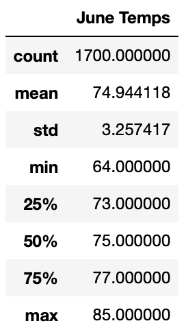
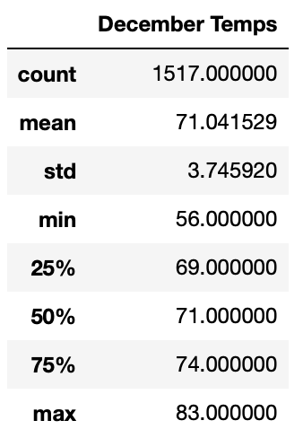

# Surfs_up

## Overview of Project
The Surfs up project has us checking weather data in Hawaii to give to our investor W.Avy for our surf and ice cream shop. We are using SQLite data from multiple different weather stations about temperatures and precipitation.

## Results

### Difference between June and December
- The highest temperature is lower in December
- The lowest temperature is lower in December
- The average temperature is lower in December

## Summary
While the information we gathered tells us that it will obviously be colder in December, there are some other factors we could account for to help us with our analysis for W.Avy. We could gather the precipitation data, find out on average how much falls in these months, and what time of the month more precipitation falls.
